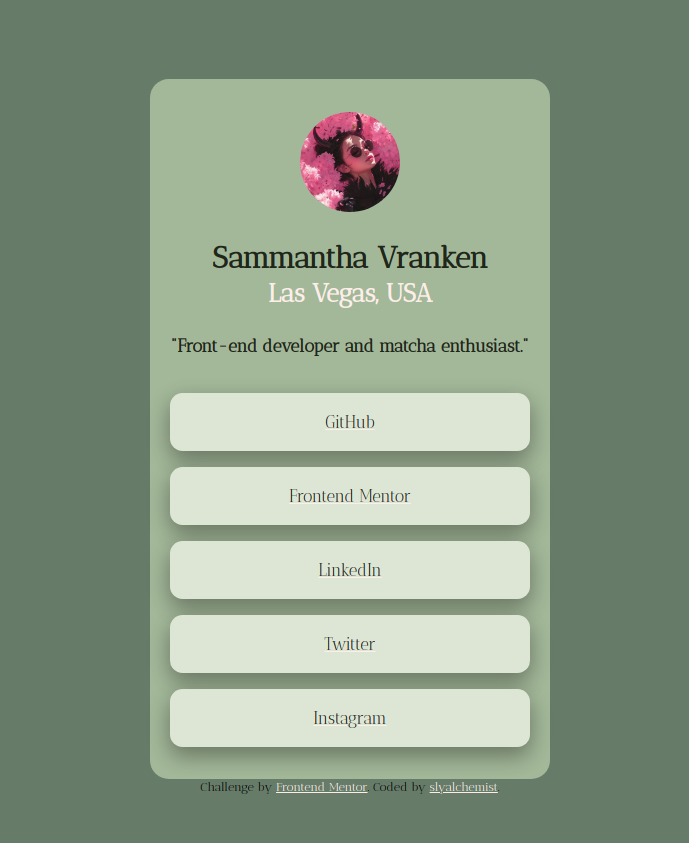

# Frontend Mentor - Social links profile solution

This is a solution to the [Social links profile challenge on Frontend Mentor](https://www.frontendmentor.io/challenges/social-links-profile-UG32l9m6dQ). Frontend Mentor challenges help you improve your coding skills by building realistic projects. 

## Table of contents

- [Overview](#overview)
  - [The challenge](#the-challenge)
  - [Screenshot](#screenshot)
  - [Links](#links)
- [My process](#my-process)
  - [Built with](#built-with)
  - [What I learned](#what-i-learned)
  - [Continued development](#continued-development)
  - [Useful resources](#useful-resources)
- [Author](#author)
- [Acknowledgments](#acknowledgments)

**Note: Delete this note and update the table of contents based on what sections you keep.**

## Overview

### The challenge

Users should be able to:

- See hover and focus states for all interactive elements on the page

### Screenshot

### Links

- Solution URL: (https://github.com/slyalchemist/personal-social-links)
- Live Site URL: (https://slyalchemist.github.io/personal-social-links/)

## My process
- I first started by only focusing on the HTML to establish the main components of the profile card. Once I had these components established, I was able to begin styling on the CSS. 
- Once I began styling, it was fairly easy to replicate the example with my own style. I only tripped up on the vertical centering of elements with the flexbox.
- After I styled to how I liked the page, I finalized the profile by inserting my profile links and a profile image.

### Built with

- Semantic HTML5 markup
- CSS custom properties
- Flexbox
- [Styled Components](https://styled-components.com/) - For styles

### What I learned

I was already largely familiar with all of the tools I used within this project, it was just a matter of remembering how to use them and troubleshooting minor issues that didn't accomodate to how I wanted the final result. 

### Continued development

In the future, I'd like to make this card a bit more responsive to different screen sizes. I may want to adapt the layout depending on the minimum width of the viewport, such as having the "about-me" and "profile-links" containers be organized horizontally when space permits. 

### Useful resources

- [MDN Web Docs](https://developer.mozilla.org/en-US/) - This helped me troubleshoot small issues I had with styling. It's one of my go-to resources.
- [W3Schools](https://www.w3schools.com/) - This is another amazing website that help me troubleshoot small issues I had with styling, and also another go-to resource. 
- [Color Hex Codes](https://www.color-hex.com/) - This is a very useful website that inspires color palettes of mine!

## Author

- Website - [Add your name here](https://www.your-site.com)
- Frontend Mentor - [@yourusername](https://www.frontendmentor.io/profile/yourusername)
- Twitter - [@yourusername](https://www.twitter.com/yourusername)

**Note: Delete this note and add/remove/edit lines above based on what links you'd like to share.**

